# VogueVista — Fashion E-Commerce

VogueVista is a full-featured fashion e-commerce web application built with Laravel. It includes an admin panel for store management and a customer-facing storefront for browsing and purchasing products.

---

## Tech Stack

- **Backend:** Laravel (PHP)
- **Frontend:** Blade Templates, Tailwind CSS
- **Database:** MySQL
- **Payment:** Cash on Delivery & QRIS

---

## Features

- Admin panel: manage products, categories, orders, home sliders, and payment settings
- Customer storefront: browse collections, wishlist, cart, checkout, and order tracking
- Authentication: register, sign in, and session management

---

## Admin Panel

### Sign In

Admin and customer authentication page. Enter your email and password to access the dashboard.

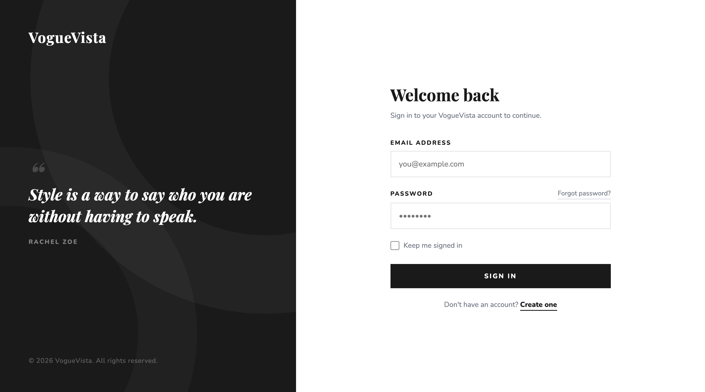

---

### Register

New user registration page. Customers fill in their full name, email, password, and confirm password to create an account.

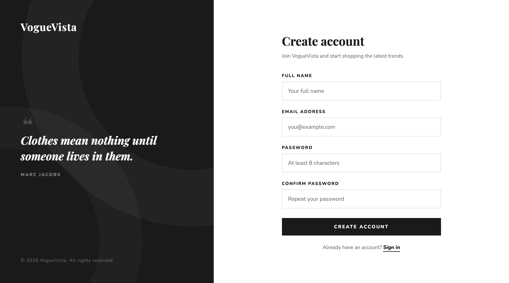

---

### Dashboard

The main admin overview page. Displays summary stats (total products, categories, orders, sliders), quick action buttons, and a recent products table.

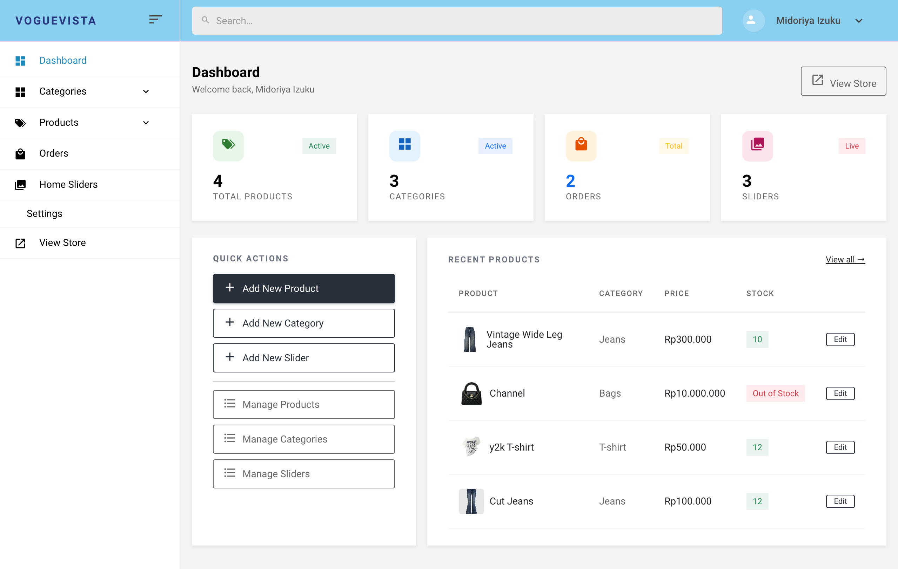

---

### All Categories

Lists all product categories with their images and names. Each row has **Edit** and **Delete** action buttons. A **+ Add Category** button is available at the top right.

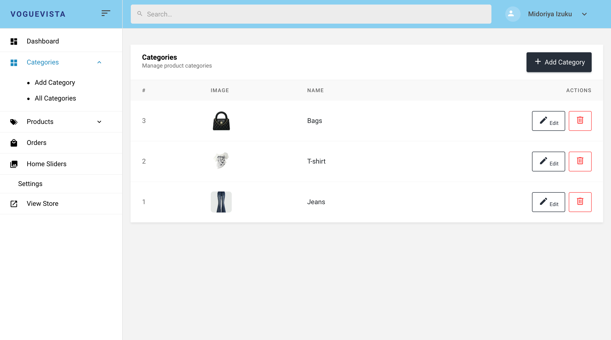

---

### Add Category

Form page to create a new product category. Fields: Name, Description, and Image upload.

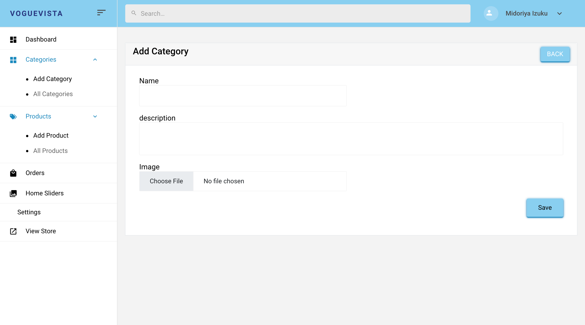

---

### All Products

Lists all store products in a table with columns for product name, description, price, stock status, and image. Each row has **Edit** and **Delete** actions.

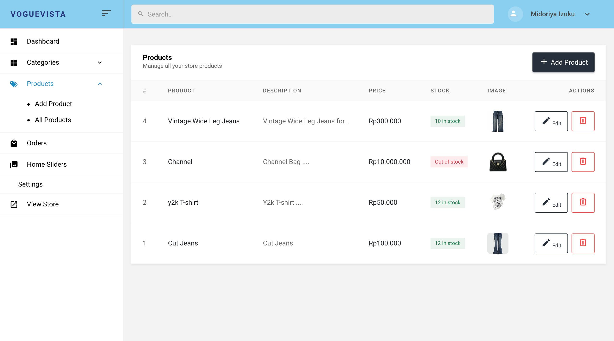

---

### Add Product

Form page to add a new product. Fields: Category (dropdown), Name, Description, Price, Quantity, and Image upload.

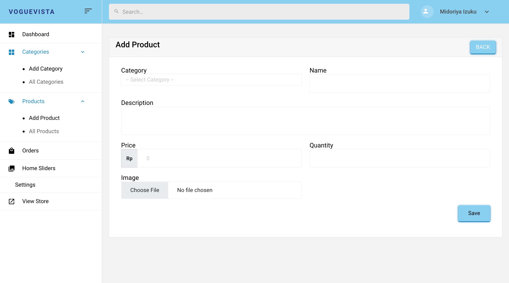

---

### View Product (Customer Side)

The product detail page seen by customers. Shows product image, name, category, price, stock availability, quantity selector, and buttons for **Add to Cart** and **Wishlist**.

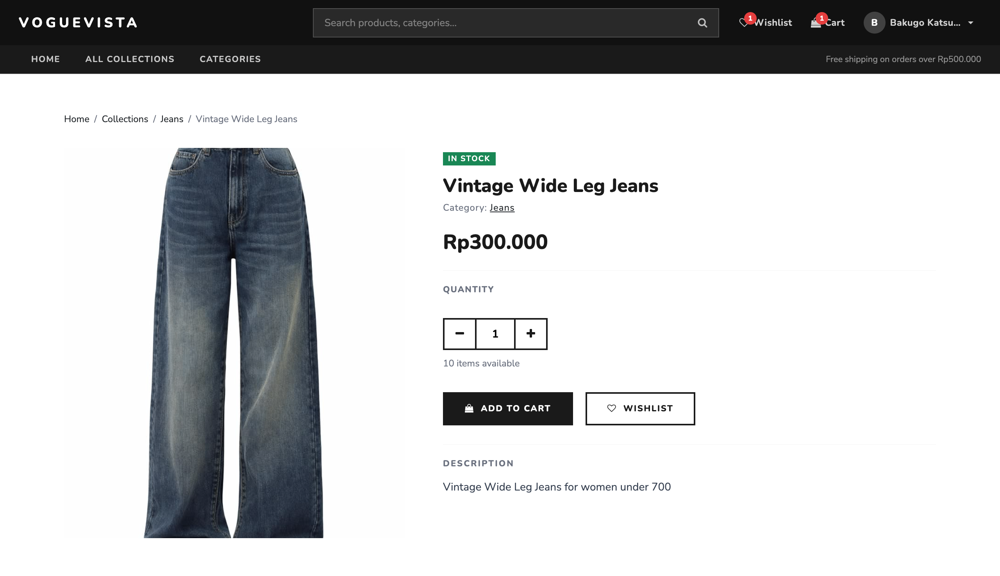

---

### Orders

Lists all incoming customer orders with tracking number, customer info, payment method, status (In Progress / Delivered), and date. Each order has a **View** button.

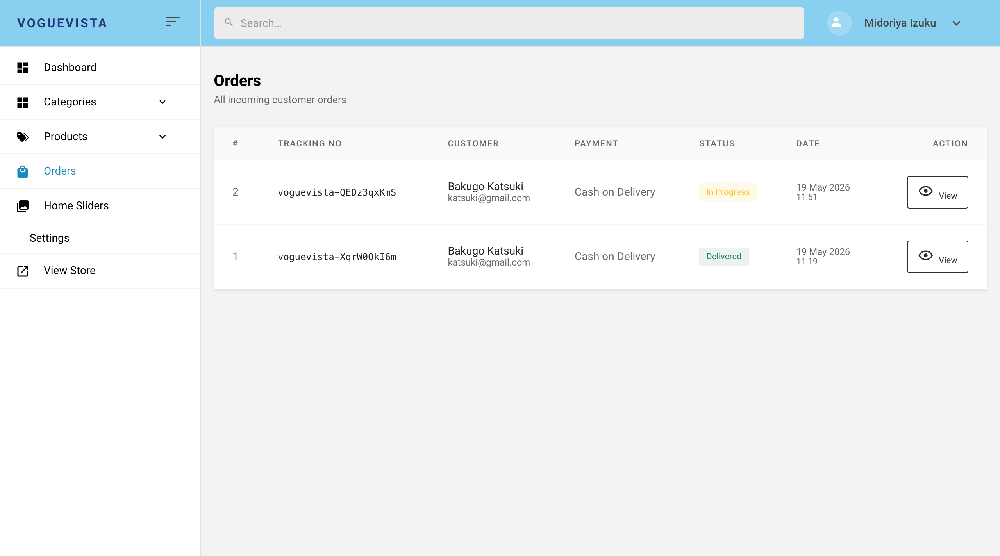

---

### Home Sliders

Manages the homepage carousel slides. Each slider entry shows an image, title, and description. Supports **Edit** and **Delete** per slide, plus **+ Add Slider**.

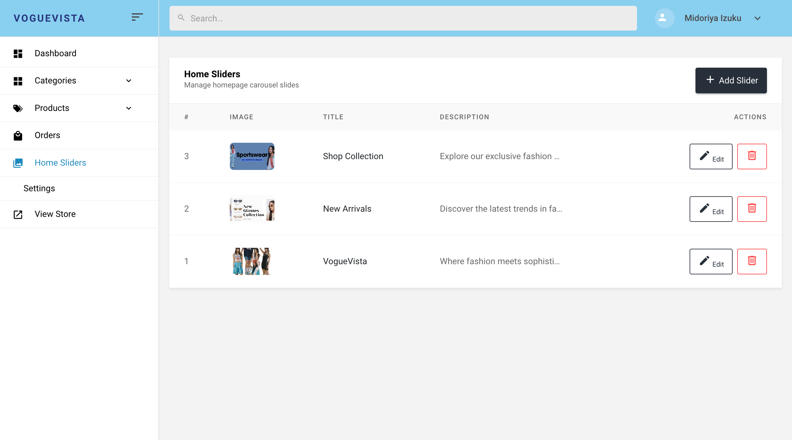

---

### Settings

Store payment settings page. Admin can upload a QRIS QR code image, set the merchant name, and optionally enter an NMID. Supported wallets include GoPay, OVO, DANA, ShopeePay, LinkAja, BCA Mobile, BNI, and Mandiri.

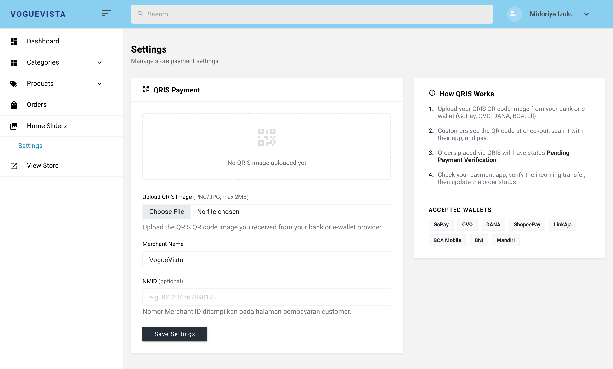

---

## Customer Storefront

### Home Page

The main storefront landing page featuring a hero carousel (home sliders), featured collections, and navigation with search, wishlist, and cart.

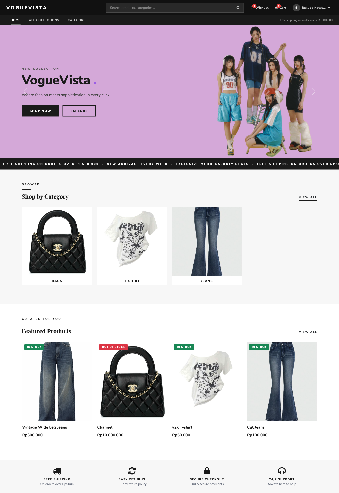

---

### All Categories

Displays all available product categories for customers to browse and filter by.

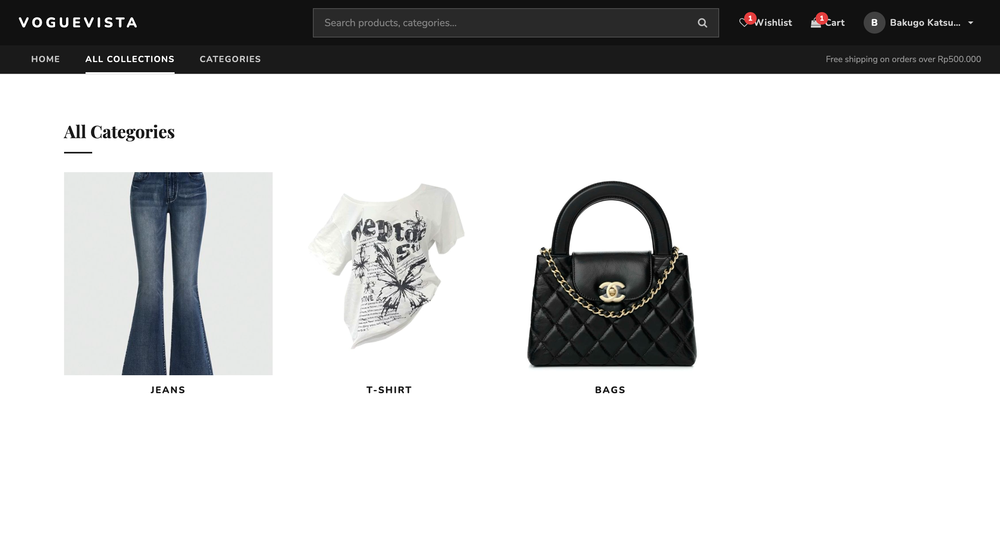

---

### Product Page

Detailed product view with image, name, category link, price, quantity selector, stock count, and Add to Cart / Wishlist buttons.

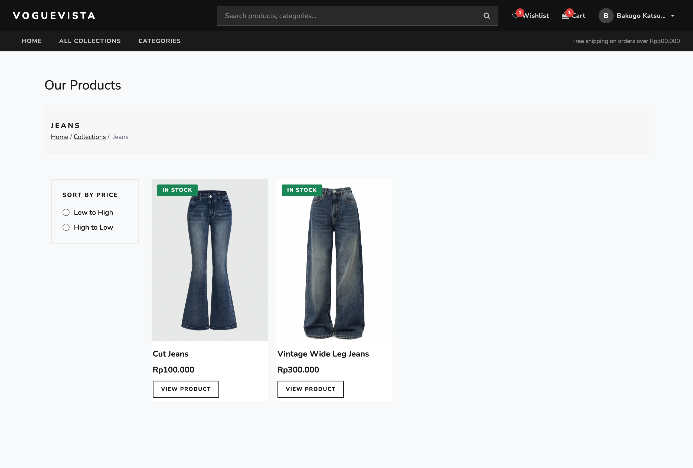

---

### Cart

Shopping cart page showing selected items, quantities, and total price before proceeding to checkout.

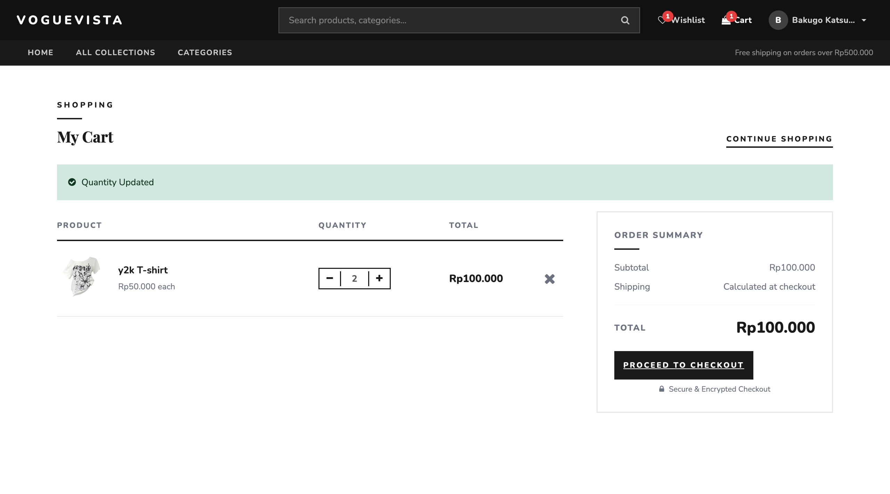

---

### Checkout

Order summary and payment method selection (Cash on Delivery or QRIS). Customer fills in shipping details and confirms the order.

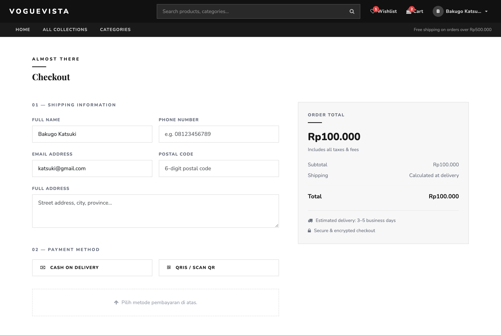

---

### My Orders

Customer order history page showing all past and active orders with tracking numbers and statuses.

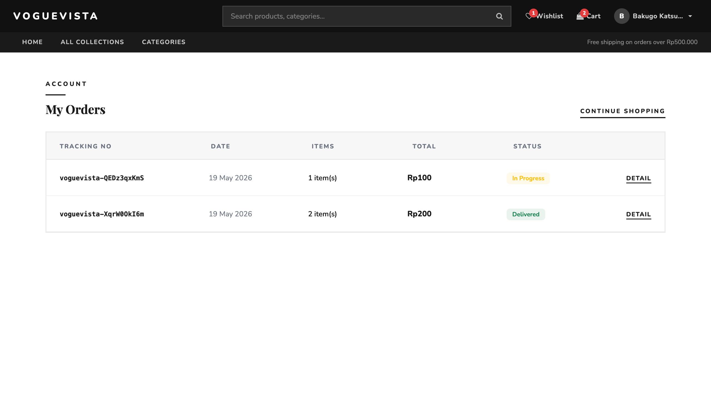

---

### My Wishlist

Saved items page. Customers can view and manage products they have wishlisted for later purchase.

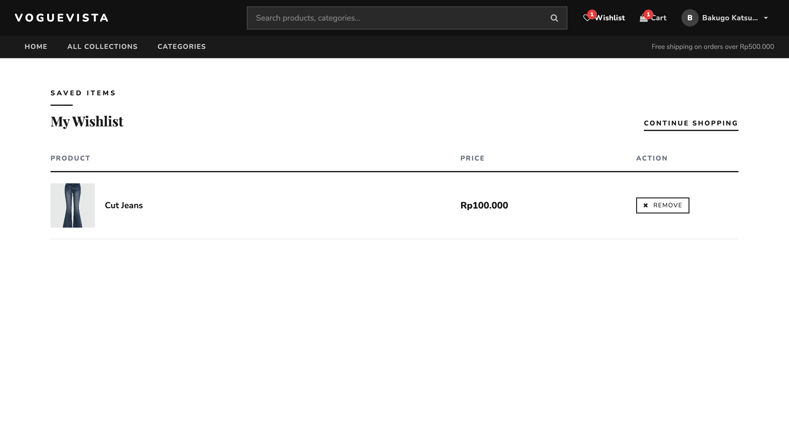

---

## Getting Started

```bash
git clone <repo-url>
cd fashion-ecommerce
composer install
npm install && npm run build
cp .env.example .env
php artisan key:generate
php artisan migrate --seed
php artisan storage:link
php artisan serve
```

---

## License

MIT
